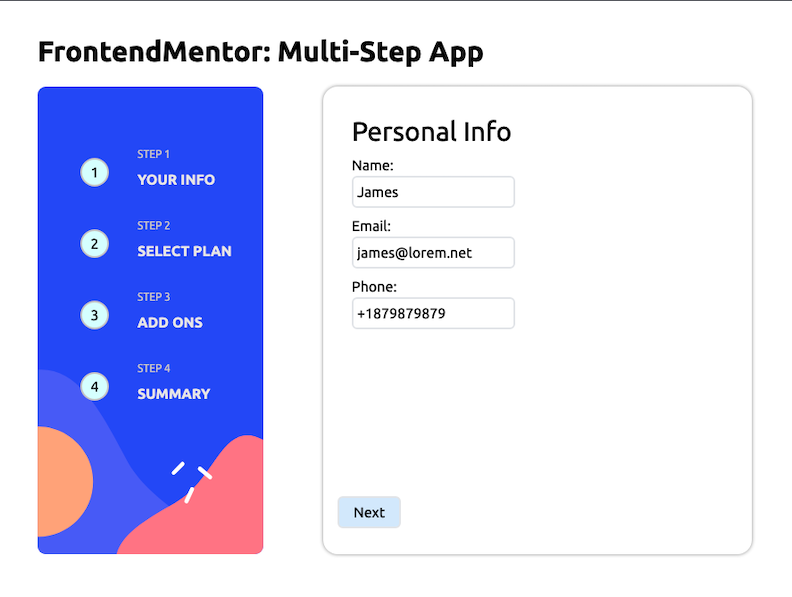

# Frontend Mentor - Multi-step form solution

This is a solution to the [Multi-step form challenge on Frontend Mentor](https://www.frontendmentor.io/challenges/multistep-form-YVAnSdqQBJ). Frontend Mentor challenges help you improve your coding skills by building realistic projects. 

## Table of contents

- [Overview](#overview)
  - [The challenge](#the-challenge)
  - [Screenshot](#screenshot)
  - [Links](#links)
- [My process](#my-process)
  - [Built with](#built-with)
  - [What I learned](#what-i-learned)
  - [Continued development](#continued-development)
  - [Useful resources](#useful-resources)
- [Author](#author)
- [Acknowledgments](#acknowledgments)

## Overview

### The challenge

Users should be able to:

- Complete each step of the sequence
- Go back to a previous step to update their selections
- See a summary of their selections on the final step and confirm their order
- View the optimal layout for the interface depending on their device's screen size
- See hover and focus states for all interactive elements on the page

### Screenshot

### Links

- Solution URL: [https://github.com/srikantgudi/multi-step-form](https://github.com/srikantgudi/multi-step-form)
- Live Site URL: [https://multi-step-form-mu-cyan.vercel.app](https://multi-step-form-mu-cyan.vercel.app)

## My process

### Built with

- SvelteKit
- Tailwind CSS

### What I learned

- Tried using `tailwindcss` with various styles and was successful in doing so.

### Continued development

- Will try and use `tailwindcss` in different projects in `sveltekit`.

### Useful resources

- [SvelteKit](https://kit.svelte.dev) - This is an amazing modern JavaScript framework to build fantastic web applications.
- [Tailwind CSS](https://tailwindcss.com/docs/installation) - This is an amazing css library which I'd recommend it to anyone still learning this concept.

## Author

- Website - [Srikantgudi](https://www.github.com/srikantgudi)
- Frontend Mentor - [@srikantgudi](https://www.frontendmentor.io/profile/srikantgudi)
